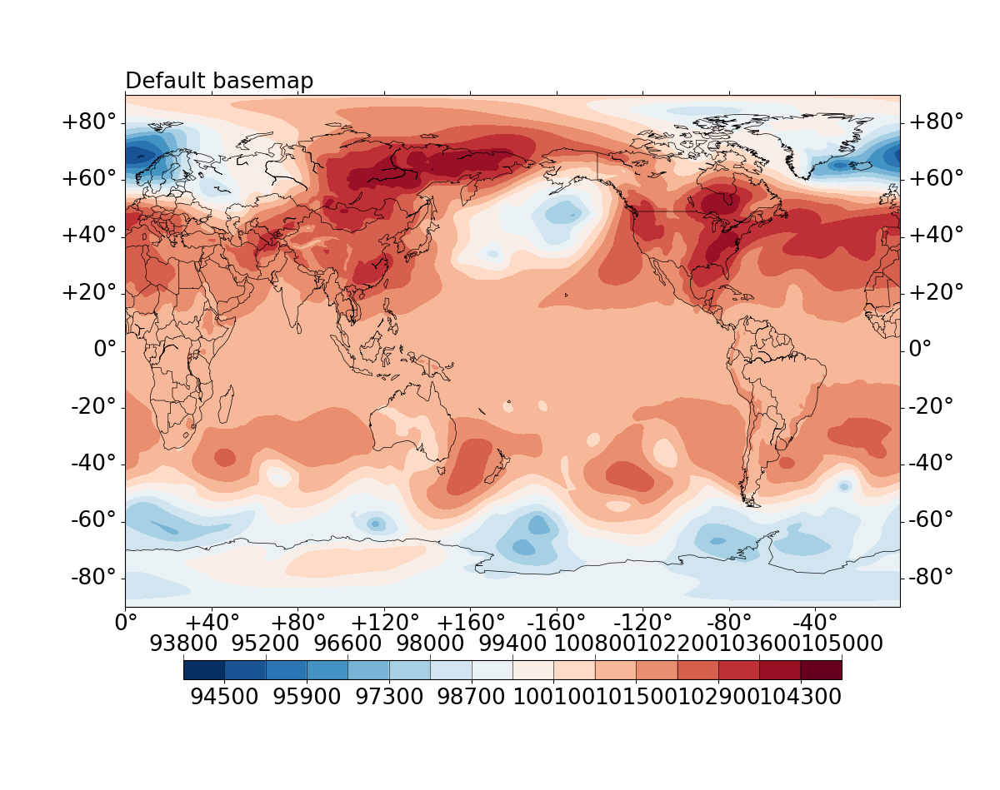
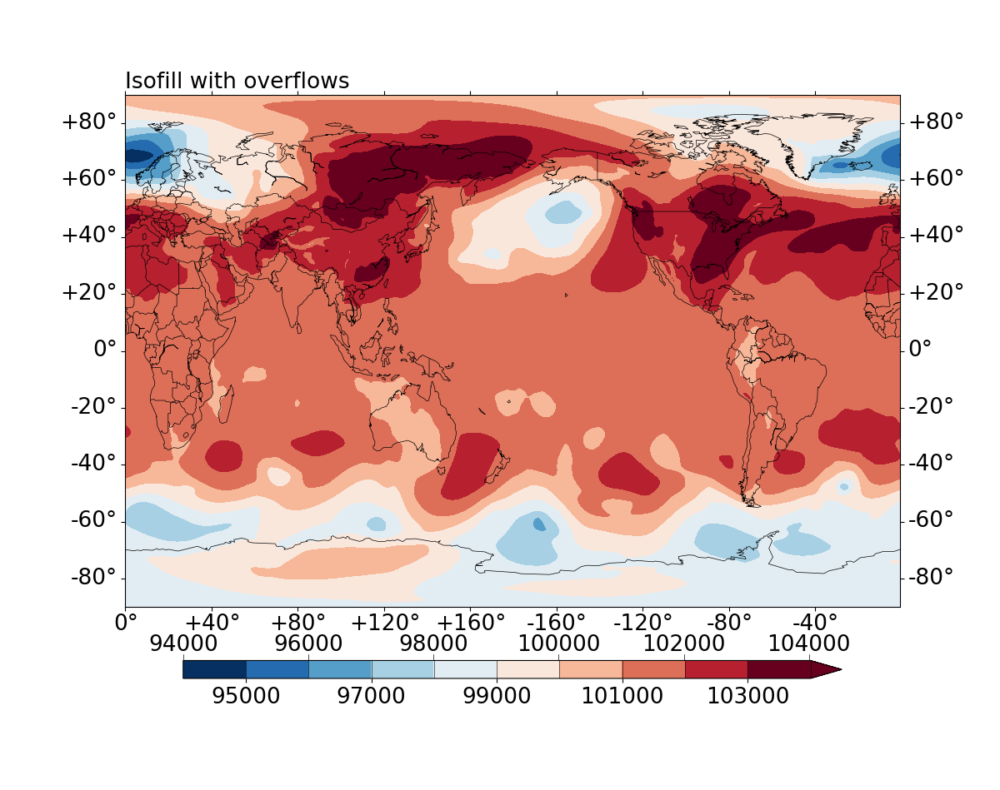
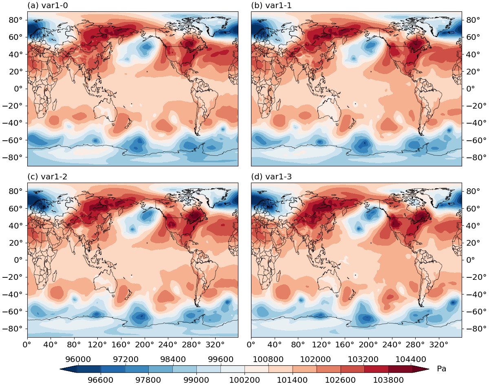

# GPlot -- a wrapper of `matplotlib`, `cartopy` and `basemap` for quick and easy geographical plots


# Dependencies

* Python>=3
* numpy
* matplotlib
* scipy
* [cartopy](https://scitools.org.uk/cartopy/docs/latest/) or [basemap](https://matplotlib.org/basemap/) (note that for usage with basemap, needs matplotlib<=3.2.2)
* [(optional) CDAT](https://github.com/CDAT/cdat)
* [(optional) netcdf4](https://unidata.github.io/netcdf4-python)


# Basic usage

The signature of the main plotting interfacing functions is:

```
gplot.plot2(var, method, ax, xarray=x, yarray=y)
```

where:

* `var` is `np.ndarray`, what to plot.
* `method` is a plotting method object, how to plot, e.g. `Isofill` which is
`contourf`, `Boxfill` which is `imshow`, `Quiver` which is `quiver` plots.
* `ax`: `matplotlib.Axes` object, where to plot.
* `xarray` and `yarray`: x- and y- coordinate. Depending on the type of `var`, these are optional.


# Examples

## Default contourf plot of surface pressure, using `basemap`

```
figure = plt.figure(figsize=(12, 10), dpi=100)
ax = figure.add_subplot(111)
iso = gplot.Isofill(var1)
gplot.plot2(var1, iso, ax, xarray=lons, yarray=lats,
	title='Default basemap', projection='cyl',
	nc_interface='netcdf4')
figure.show()
```

|  |
| :--: |
|Default contourf plot of global surface pressure field (in Pa), from ERA-I.|

where `var1`, `lons` and `lats` can be obtained, for instance, via `netcdf4`:

```
fin=netcdf4.Dataset(DATA_FILE_NAME, 'r')
var1=fin.variables['msl'][:]
lons=fin.variables['longitude']
lats=fin.variables['latitude']
```

Currently, netCDF file interfaces of `netcdf4` and `CDAT` are supported, `iris` and `xarray` are
planned.


## Control the number of contourf levels and overflow

```
figure = plt.figure(figsize=(12, 10), dpi=100)
ax = figure.add_subplot(111)
iso = gplot.Isofill(var1, num=10, zero=1, split=1,
                    min_level=11000, qr=0.01)
gplot.plot2(
    var1, iso, ax, xarray=lons, yarray=lats,
    title='Isofill with overflows', projection='cyl',
    nc_interface='netcdf4')
figure.show()
```

|  |
| :--: |
|Contourf plot of global surface pressure field (in Pa), from ERA-I. Control the number of contourf levels and set overflow levels on both ends.|

where:

* `num=10` specifies the desired number of contourf levels.
* `zero=1`: 0 is allowed to be one of the contourf levels.
* `split=1`: split a divergence colorbar if the plotted data has both positive and negative values.
* `min_level`: desired minimum level of the contourf levels.
* `qr=0.01`: desired maximum level of the contourf levels, specified by the 0.01 right quantile.


## Multiple subplots sharing a same colorbar

```
figure = plt.figure(figsize=(12, 10), dpi=100)
plot_vars = [var1[ii] for ii in range(4)]
iso1 = gplot.Isofill(plot_vars, ql=0.005, qr=0.001)
titles = ['var1-%d' % ii for ii in range(4)]

for ii, vii in enumerate(plot_vars):
    ax = figure.add_subplot(2, 2, ii+1)
    gplot.plot2(
        vii, iso1, ax, xarray=lons, yarray=lats, title=titles[ii],
        legend='global', projection='cyl', nc_interface='netcdf4')

figure.show()
```

|  |
| :--: |
|Contourf plot of global surface pressure field (in Pa), from ERA-I. The 4 subplots are sharing the same colorbar.|

## More examples are given in the `tests` subfolder


