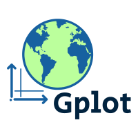

# GPlot -- a wrapper of `matplotlib`, `cartopy` and `basemap` for quick and easy geographical plots



# Install

Install using conda:

```
conda install -c guangzhi gplot
```


# Basic usage

The signature of the main plotting interfacing function is:

```
from gplot import plot2
plot2(var, method, ax, x=x, y=y)
```

where:

* `var` is `np.ndarray`, what to plot.
* `method` is a plotting method object, how to plot, e.g. `Isofill` which is
`contourf`, `Boxfill` which is `imshow`, `Quiver` which is `quiver` plots.
* `ax`: `matplotlib.Axes` object, where to plot.
* `x` and `y`: x- and y- coordinate.


# Examples

## Default contourf plot of surface pressure, using `basemap`

```
import gplot
figure = plt.figure(figsize=(12, 10), dpi=100)
ax = figure.add_subplot(111)
iso = gplot.Isofill(var)
gplot.plot2(var, iso, ax, x=lons, y=lats,
	title='Default basemap', projection='cyl',
	nc_interface='netcdf4')
figure.show()
```

|  |
| :--: |
|Default contourf plot of global surface pressure field (in Pa), from ERA-I.|

where `var`, `lons` and `lats` can be obtained, for instance, via `netcdf4`:

```
fin = netcdf4.Dataset(DATA_FILE_NAME, 'r')
var = fin.variables['msl'][:]
lons = fin.variables['longitude']
lats = fin.variables['latitude']
```

Currently, netCDF file reading using `netcdf4` and `CDAT` are supported, `iris`
and `xarray` are planned.


## Control the number of contourf levels and overflow

```
import gplot
figure = plt.figure(figsize=(12, 10), dpi=100)
ax = figure.add_subplot(111)
iso = gplot.Isofill(var, num=10, zero=1, split=1,
                    vmin=11000, qr=0.01)
gplot.plot2(
    var, iso, ax, x=lons, y=lats,
    title='Isofill with overflows', projection='cyl',
    nc_interface='netcdf4')
figure.show()
```

|  |
| :--: |
|Contourf plot of global surface pressure field (in Pa), from ERA-I. Control the number of contourf levels and set overflow levels on both ends.|

where:

* `num = 10` specifies the desired number of contourf levels.
* `zero = 1`: 0 is allowed to be one of the contourf levels.
* `split = 1`: split a divergence colorbar if the plotted data has both positive and negative values.
* `vmin = 11000`: desired minimum level of the contourf levels.
* `qr = 0.01`: desired maximum level of the contourf levels, specified by the 0.01 right quantile.


## Multiple subplots sharing a same colorbar

```
import gplot
figure, axes=plt.subplots(figsize=(12,10), nrows=2, ncols=2, constrained_layout=True)
plot_vars=[var[ii] for ii in range(4)]
iso=gplot.Isofill(plot_vars, ql=0.005, qr=0.001)
titles=['var-%d' %ii for ii in range(4)]

for ii, vii in enumerate(plot_vars):
ax=axes.flat[ii]
gplot.plot2(vii, iso, ax, title=titles[ii], legend='global', projection='cyl')

figure.show()
```

|  |
| :--: |
|Contourf plot of global surface pressure field (in Pa), from ERA-I. The 4 subplots are sharing the same colorbar.|


## More examples are given in the `tests` subfolder


# Documentation

More detailed documentation can be found at: https://gplot.readthedocs.io/en/latest/


# Dependencies

* Python>=3
* numpy
* matplotlib
* scipy
* [netcdf4](https://unidata.github.io/netcdf4-python)
* [basemap](https://matplotlib.org/basemap/) (note that for usage with basemap,
  needs matplotlib<=3.2.2) or
  [cartopy (WIP)](https://scitools.org.uk/cartopy/docs/latest/)
* [(optional) CDAT](https://github.com/CDAT/cdat)


# Contributing and getting help

This package is still in **early alpha**.

We welcome contributions from the community. Please create a fork of the
project on GitHub and use a pull request to propose your changes. We strongly
encourage creating an issue before starting to work on major changes, to
discuss these changes first.

