# GPlot -- a wrapper of `matplotlib` and `cartopy` for quick and easy geographical plots


# Install

Clone this repo:

```
git clone -b cartopy-simplify https://github.com/Xunius/gplot.git
```

# Basic usage

```python
import matplotlib.pyplot as plt
import cartopy.crs as ccrs
from gplot import Plot2Cartopy

figure = plt.figure(figsize=(8, 6), dpi=100)
ax = figure.add_subplot(111, projection=ccrs.PlateCarree())

# prepare your data here
data = ...
lons = ...
lats = ...

# Isofill defines a contourf plot
method = gplot.Isofill(data, 10, 1, 1, ql=0.005, qr=0.001)

# create a plotting object
pobj = Plot2Cartopy(data, method, lons, lats, ax=ax,
                    title='contourf', projection=ccrs.PlateCarree())
# do plot
pobj.plot()

# show plot
figure.show()
```

where:

* `data` is `np.ndarray`, what to plot.
* `method` is a plotting method object, how to plot, e.g. `Isofill` which is
`contourf`, `Boxfill` which is `imshow`, `Quiver` which is `quiver` plots.
* `ax`: `matplotlib.Axes` object, where to plot.
* `lons` and `lats`: longitude and latitude coordinate.


# Examples

## Default contourf plot of sea level pressure

```python
figure = plt.figure(figsize=(8, 6), dpi=100)
ax = figure.add_subplot(111, projection=ccrs.PlateCarree())

iso = gplot.Isofill(msl, num=10, zero=1, split=1, ql=0.001, qr=0.001)

pobj = Plot2Cartopy(msl, iso, lons, lats, ax=ax,
                    title='default cartopy', projection='cyl')
pobj.plot()
figure.show()
```

| 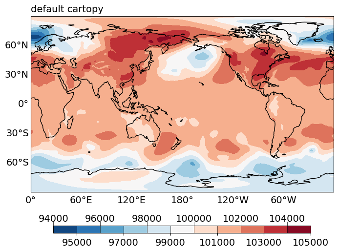 |
| :--: |
|Default contourf plot of global sea level pressure field (in Pa), from ERA-I.|

where `msl`, `lons` and `lats` can be obtained, for instance, via `netcdf4`:

```
fin = netcdf4.Dataset(DATA_FILE_NAME, 'r')
msl = fin.variables['msl'][:]
lons = fin.variables['longitude'][:]
lats = fin.variables['latitude'][:]
```


## Control the number of contourf levels and overflow

```python
import gplot

figure = plt.figure(figsize=(12, 10), dpi=100)
ax = figure.add_subplot(111)
iso = gplot.Isofill(var, num=10, zero=1, split=1, vmin=95000, qr=0.01)

pobj = Plot2Cartopy(var, iso, lons, lats, ax=ax,
                    title='Isofill with overflow', projection='cyl')
pobj.plot()
figure.show()
```

| 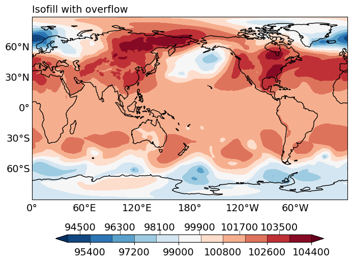 |
| :--: |
|Contourf plot of global sea level pressure field (in Pa), from ERA-I. Control the number of contourf levels and set overflow levels on both ends.|

where:

* `num = 10` specifies the **desired** number of contourf levels.
* `zero = 1`: 0 is allowed to be one of the contourf levels.
* `split = 1`: split a divergence colorbar if the plotted data have both positive and negative values.
* `vmin = 95000`: **desired** minimum level of the contourf levels.
* `qr = 0.01`: **desired** maximum level of the contourf levels, specified by the 0.01 right quantile.


## Turn axes labels off


```python
import gplot

figure = plt.figure(figsize=(8, 6), dpi=100)
ax = figure.add_subplot(111, projection=ccrs.PlateCarree())

iso = gplot.Isofill(var, num=10, zero=1, split=1)

pobj = Plot2Cartopy(var, iso, lons, lats, ax=ax,
                    title='label_axes=False', projection='cyl',
                    label_axes=False)
pobj.plot()
```

| 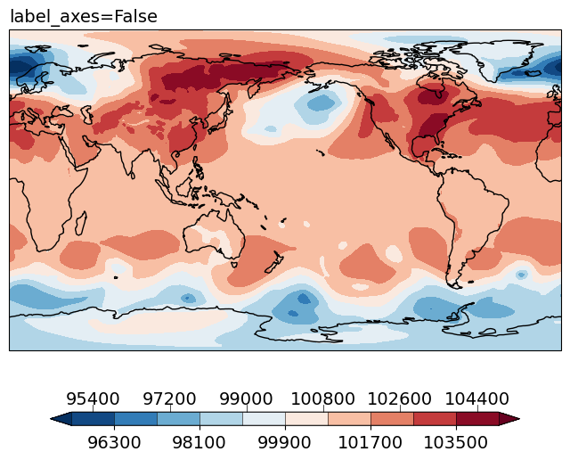 |
| :--: |
|Contourf plot of global sea level pressure field (in Pa), from ERA-I. Turn off latitude-longitude axes labels.|

where:

* `label_axes=False`: turn off axes labels.


## Add axes grid

```python
import gplot

figure = plt.figure(figsize=(8, 6), dpi=100)
ax = figure.add_subplot(111, projection=ccrs.PlateCarree())

iso = gplot.Isofill(var, 10, 1, 1, ql=0.005, qr=0.001)

pobj = Plot2Cartopy(var, iso, lons, lats, ax=ax,
                    title='axes_grid=True', projection='cyl',
                    axes_grid=True)
pobj.plot()
```

|  |
| :--: |
|Contourf plot of global sea level pressure field (in Pa), from ERA-I. Add latitude-longitude axes grid lines.|

where:

* `axes_grid=True`: turn on axes grid lines.


## Use vertical colorbar

```python
import gplot

figure = plt.figure(figsize=(8, 6), dpi=100)
ax = figure.add_subplot(111, projection=ccrs.PlateCarree())

iso = gplot.Isofill(var, 10, 1, 1, ql=0.005, qr=0.001)

pobj = Plot2Cartopy(var, iso, lons, lats, ax=ax,
                    title='legend_ori="vertical"', projection='cyl',
                    legend_ori='vertical')
pobj.plot()
```

| 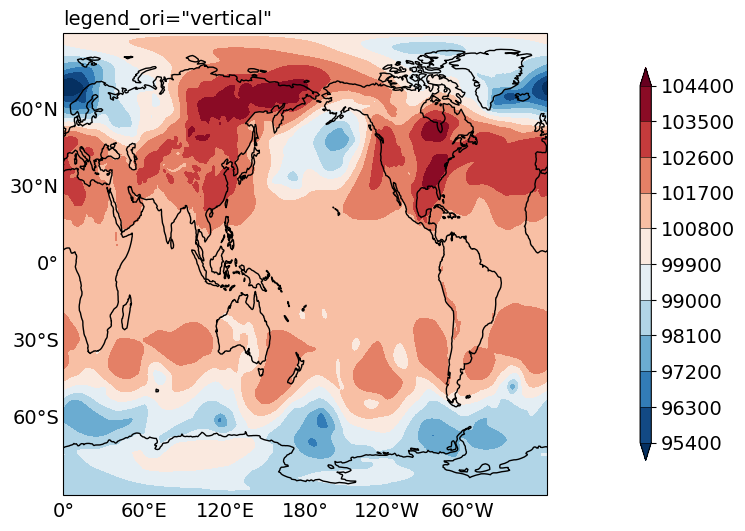 |
| :--: |
|Contourf plot of global sea level pressure field (in Pa), from ERA-I. Use vertical colorbar.|

where:

* `legend_ori='vertical'`: set colorbar orientation to be vertical.


## Plot region shading


```python
import gplot

figure = plt.figure(figsize=(8, 6), dpi=100)
ax = figure.add_subplot(111, projection=ccrs.PlateCarree())

# plot contourf first
iso = gplot.Isofill(var, 10, 1, 1, ql=0.005, qr=0.001)

pobj = Plot2Cartopy(var, iso, lons, lats, ax=ax,
                    title='Isofill with region shading', projection='cyl',)
pobj.plot()

# create a shading plotting method, color set to green, alpha=0.5
shading = gplot.Shading(color='g', alpha=0.5)

# shade regions where var >= 80th percentile
thres = np.percentile(var, 80)
shadevar = np.where(var >= thres, 1, np.nan)

# plot the shading
pobj = Plot2Cartopy(shadevar, shading, lons, lats, ax=ax,
            title='Cartopy with shading', clean=True, projection='cyl',)
pobj.plot()
```

| 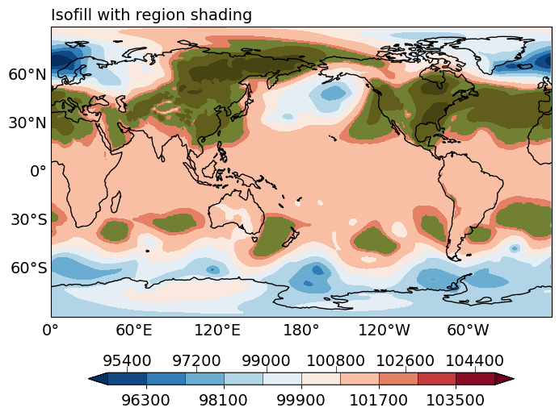 |
| :--: |
|Contourf plot of global sea level pressure field (in Pa), from ERA-I. Shade regions where msl >= the 80th percentile with a transparent green color.|


## Add stroke to contourf

```python
import gplot

figure = plt.figure(figsize=(8, 6), dpi=100)
ax = figure.add_subplot(111, projection=ccrs.PlateCarree())

iso = gplot.Isofill(var, 10, 1, 1, ql=0.005, qr=0.001, stroke=True)

pobj = Plot2Cartopy(var, iso, lons, lats, ax=ax,
                    title='Isofill with stroke', projection='cyl')
pobj.plot()
```

|  |
| :--: |
|Contourf plot of global sea level pressure field (in Pa), from ERA-I. Add stroke line to contourf plot.|

where:

* `stroke=True`: add stroke line.


## Force splitting negative-positive values in data to the left-right half of a divergence colormap

```python
import gplot

figure = plt.figure(figsize=(8, 6), dpi=100)
ax = figure.add_subplot(111, projection=ccrs.PlateCarree())

iso = gplot.Isofill(var, 10, 1, split=2, ql=0.005, qr=0.001)

pobj = Plot2Cartopy(var, iso, lons, lats, ax=ax,
                    title='Isofill force split colors', projection='cyl')
pobj.plot()
```

| 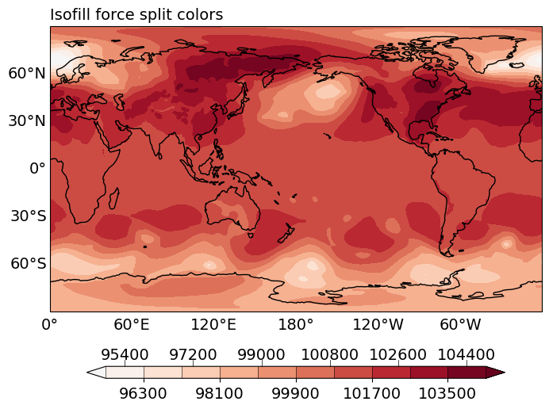 |
| :--: |
|Contourf plot of global sea level pressure field (in Pa), from ERA-I. Force negative (positive) values in data to use the left (right) -half of the colormap.|

The colormap used is a Blue-White-Red colormap.
By using `split=2`, we force the negative values to be plotted using
the left-half of the colormap, i.e. blue colors, and positive values the
right-half, i.e. red colors.

Since the values we plot are all positive, we see only red colors.


## Boxfill/imshow plot

```python
import gplot

figure = plt.figure(figsize=(8, 6), dpi=100)
ax = figure.add_subplot(111, projection=ccrs.PlateCarree())

box = gplot.Boxfill(var, split=1, ql=0.005, qr=0.001)

pobj = Plot2Cartopy(var, box, lons, lats, ax=ax,
                    units='hPa',
                    title='boxfill', projection='cyl')
pobj.plot()
```

| 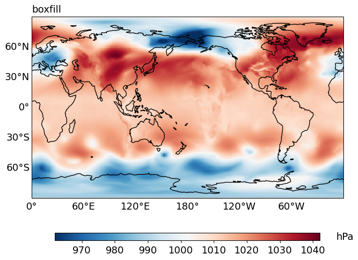 |
| :--: |
|Contourf plot of global sea level pressure field (in hPa), from ERA-I. Plot using imshow (continuous colorbar).|

where:

* `gplot.Boxfill` defines an `imshow` plot.
* `units='hPa'` specifies the unit labeled aside the colorbar.


## Multiple subplots with their own colorbars

```python
import gplot

figure = plt.figure(figsize=(8, 6), dpi=100)
plot_vars = [var1, var2, var1, var2]

iso1 = gplot.Isofill(var1, 10, 1, 1, ql=0.005, qr=0.001)
iso2 = gplot.Isofill(var2, 10, 1, 1, ql=0.05, qr=0.05)

titles = ['msl', 'sst', 'msl', 'sst']
units = ['Pa', 'K', 'Pa', 'K']

for ii, vii in enumerate(plot_vars):
    ax = figure.add_subplot(2, 2, ii+1, projection=ccrs.PlateCarree())
    #ax = axes.flatten()[ii]

    if ii % 2 == 0:
        isoii = iso1
    elif ii % 2 == 1:
        isoii = iso2

    Plot2Cartopy(vii, isoii, lons, lats, ax=ax,
                 units=units[ii],
                 title=titles[ii], projection='cyl',
                 legend='local', fontsize=5).plot()

figure.tight_layout()
figure.show()
```

| 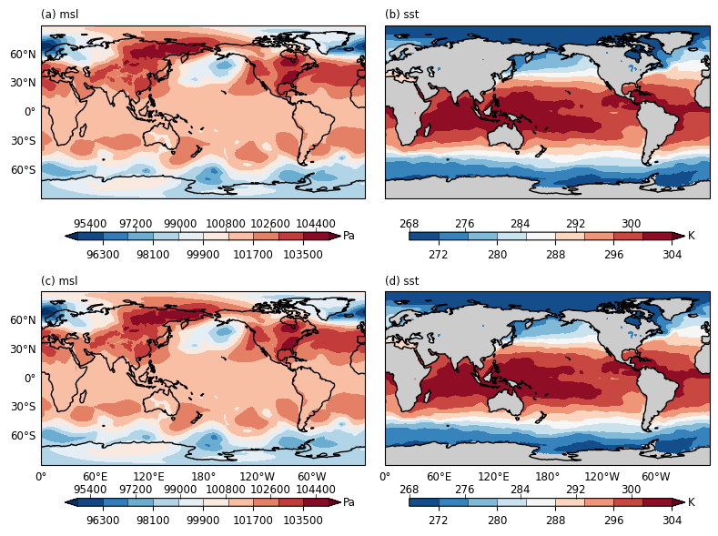 |
| :--: |
|Contourf plot of global sea level pressure field (in hPa, in (a) and (c)),
and sea surface temperature (in K, in (b) and (d)), from ERA-I. Each subplot has its own colorbar.|

where:

* `legend='local'` specifies that each subplot uses its own colobar.


## Multiple subplots sharing a same colorbar

```
figure = plt.figure(figsize=(8, 6), dpi=100)
plot_vars = [msl, msl, msl, msl]

iso = gplot.Isofill(msl, 10, 1, 1, ql=0.005, qr=0.001)
titles = ['msl', 'msl', 'msl', 'msl']

for ii, vii in enumerate(plot_vars):
    ax = figure.add_subplot(2, 2, ii+1, projection=ccrs.PlateCarree())

    Plot2Cartopy(vii, iso, lons, lats, ax=ax,
                        title=titles[ii], projection='cyl',
                        legend='global', fix_aspect=False).plot()
figure.show()
```

| 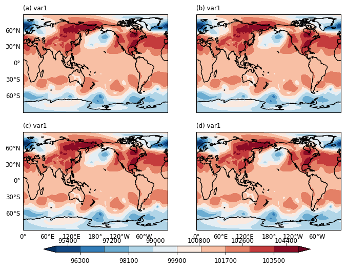 |
| :--: |
|Contourf plot of global sea level pressure field (in Pa), from ERA-I. The 4 subplots are sharing the same colorbar.|


## Update data in an Isofill plot

```python
import gplot

proj = ccrs.PlateCarree()

# there are 10 data arrays to plot, put in a list:
var_list = [ var * (1+ii/100) for ii in range(10) ]

figure = plt.figure(figsize=(12, 10), dpi=100)
ax = figure.add_subplot(111, projection=proj)

# create the Isofill plotting method obj using all the variables
iso = gplot.Isofill(var_list, 10, 1, 1, ql=0.005, qr=0.001)

# loop through all arrays to plot
for ii, varii in enumerate(var_list):

    # plot the 1st plot
    if ii == 0:
        plotobj = Plot2Cartopy(
            varii, iso, ax=ax, legend='global', x=lons, y=lats,
            units='Pa',
            title='update_plot', projection=proj)
        plotobj.plot()
    else:
        # from the 2nd array onwards, do update plot
        plotobj.update_plot(varii)

    #----------------- Save plot ------------
    plot_save_name = f'test_cartopy_update_plot_{ii}.png'
    figure.savefig(plot_save_name, dpi=100, transparent=False)
```

Below are the 1st 2 plots:


|  |
| :--: |
|Contourf plot of global sea level pressure field (in Pa), from ERA-I. The 1st plot in sequence.|


| 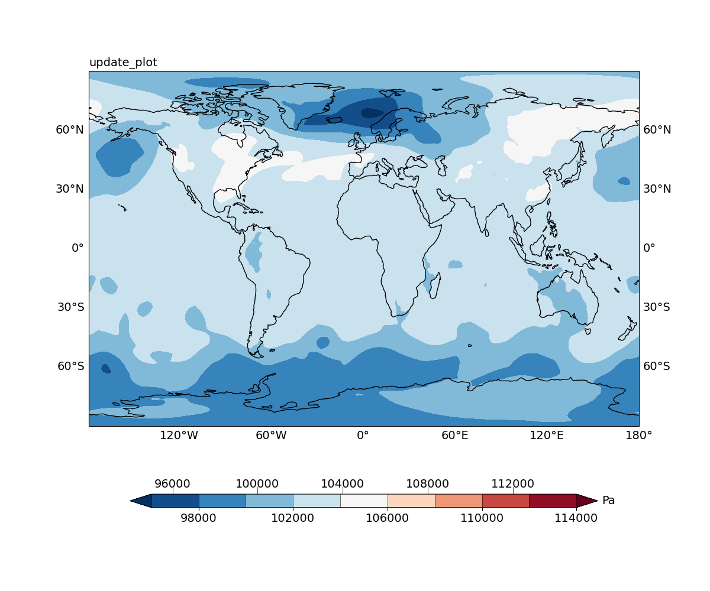 |
| :--: |
|Contourf plot of global sea level pressure field (in Pa), from ERA-I. The 2nd plot in sequence.|


**NOTE**: this `plotobj.update_plot(varii)` method call updates only the core data plotting function, leaving the colorbar, axes, axes labels etc. as there were in the 1st plot. This helps saving plot time, and the more variables to plot in the sequence, the more time saved. See `tests/speed_tests.py` for a comparison of the plotting time.


## Vector quiver plot


```python
import gplot

figure = plt.figure(figsize=(8, 6), dpi=100)
ax = figure.add_subplot(111, projection=ccrs.PlateCarree())

q = gplot.Quiver(step=5)

plotobj = Plot2QuiverCartopy(u, v, q, x=lons, y=lats,
                             ax=ax, title='default quiver',
                             projection='cyl')

plotobj.plot()
```

| 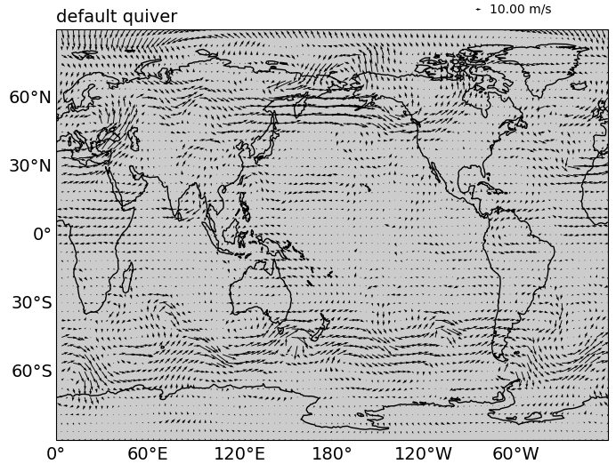 |
| :--: |
|Quiver plot of global 10m wind (in m/s), from ERA-I.|

where:

* `gplot.Quiver(step=5)` defines a quiver plotting method. `step=5` means
sub-sampling the data every `5` data points in the x- and y- dimensions.
The default `keylength` is `0.0015`, and default `scale` is computed from the input vector's magnitude.


## Update data in a vector plot


```python
import gplot

proj = ccrs.PlateCarree()

# there are 10 data arrays to plot, put in a list:
u_list = [ u, ] * 10
v_list = [ v, ] * 10

figure = plt.figure(figsize=(12, 10), dpi=100)
ax = figure.add_subplot(111, projection=proj)
q = gplot.Quiver(step=5)

for ii, (uii, vii) in enumerate(zip(u_list, v_list)):

    # plot the 1st plot
    if ii == 0:
        plotobj = Plot2QuiverCartopy(uii, vii, q, x=lons, y=lats, ax=ax,
                                     title='quiver update_plot',
                                     projection=proj)

        plotobj.plot()
    else:
        # from the 2nd array onwards, do update plot
        plotobj.update_plot(uii, vii)

    #----------------- Save plot ------------
    plot_save_name = f'test_cartopy_quiver_update_plot_{ii}.png'
    figure.savefig(plot_save_name, dpi=100, transparent=False)
```

Below are the 1st 2 plots:


| 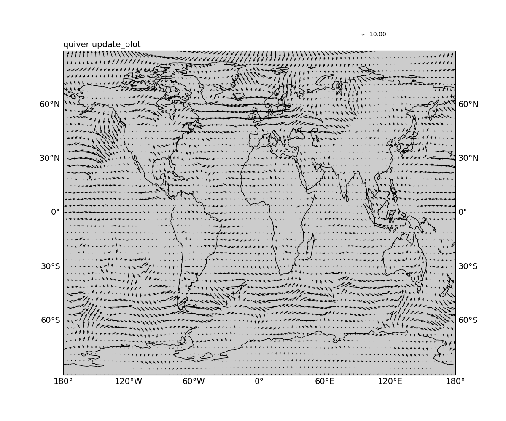 |
| :--: |
|Quiver plot of global 10m wind (in m/s), from ERA-I. The 1st plot in a sequence of 10.|


|  |
| :--: |
|Quiver plot of global 10m wind (in m/s), from ERA-I. The 2nd plot in a sequence of 10.|


**NOTE**: this `plotobj.update_plot(varii)` method call updates only the core data plotting function, leaving the colorbar, axes, axes labels etc. as there were in the 1st plot. This helps saving plot time, and the more variables to plot in the sequence, the more time saved. See `tests/speed_tests.py` for a comparison of the plotting time.


## Wind barbs, CMA style

```python
import gplot

figure = plt.figure(figsize=(8, 6), dpi=100)
ax = figure.add_subplot(111, projection=ccrs.PlateCarree())

q = gplot.Barbs(step=14, linewidth=0.5, keylength=5, standard='cma')

plotobj = Plot2QuiverCartopy(uu, vv, q, x=lons, y=lats, ax=ax,
                             title='Wind barbs, CMA style',
                             projection='cyl')

plotobj.plot()
```

| 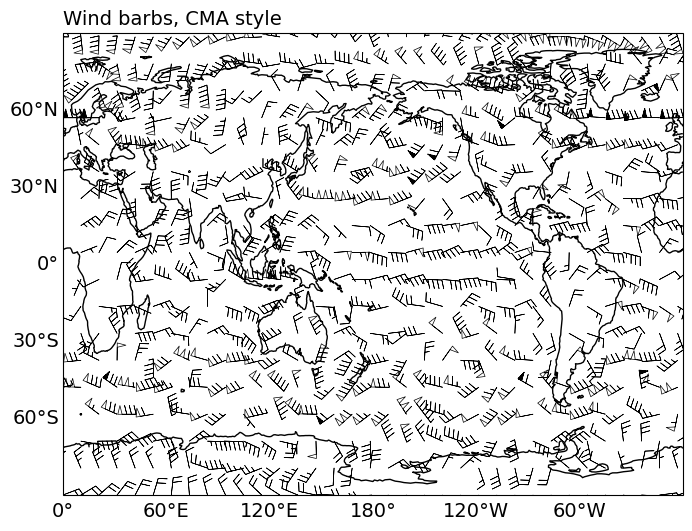 |
| :--: |
|Wind barbs plot of global 10m wind (in m/s), from ERA-I. Using the CMA standard: short barb = 2 m/s, Full barg = 4 m/s, hallow flag = 20 m/s, solid flag = 40 m/s.|

In CMA style wind barbs:
* short bar = 2 m/s,
* full bar = 4 m/s,
* hallow flag = 20 m/s,
* solid flag = 40 m/s.


## Wind barbs, the default style


```python
import gplot

figure = plt.figure(figsize=(8, 6), dpi=100)
ax = figure.add_subplot(111, projection=ccrs.PlateCarree())

q = gplot.Barbs(step=14, linewidth=0.5, keylength=5, standard='default')

plotobj = Plot2QuiverCartopy(uu, vv, q, x=lons, y=lats, ax=ax,
                             title='Wind barbs, default style',
                             projection='cyl')

plotobj.plot()
```

|  |
| :--: |
|Wind barbs plot of global 10m wind (in m/s), from ERA-I. Using the default standard: short barb = 5 m/s, Full barb = 10 m/s, solid flag = 50 m/s.|

In default style wind barbs:
* short bar = 5 m/s,
* full bar = 10 m/s,
* solid flag = 50 m/s.


## Update data in a wind barbs plot

```python
import gplot

proj = ccrs.PlateCarree()

# there are 10 data arrays to plot, put in a list:
u_list = [ u, ] * 10
v_list = [ v, ] * 10

figure = plt.figure(figsize=(12, 10), dpi=100)
ax = figure.add_subplot(111, projection=proj)
q = gplot.Barbs(step=14, linewidth=0.5, keylength=5, standard='cma')

for ii, (uii, vii) in enumerate(zip(u_list, v_list)):

if ii == 0:

    # plot the 1st plot
    plotobj = Plot2QuiverCartopy(uii, vii, q, x=self.lons,
                                 y=self.lats, ax=ax,
                                 title='barbs update_plot',
                                 projection=proj)
    plotobj.plot()
else:
    # from the 2nd array onwards, do update plot
    plotobj.update_plot(uii, vii)

#----------------- Save plot ------------
plot_save_name = f'test_cartopy_barbs_update_plot_{ii}.png'
figure.savefig(plot_save_name, dpi=100, transparent=False)
```


## Use a custom colormap

```python
import gplot
from gplot.lib.Colormaps import cma_colormaps

figure = plt.figure(figsize=(8, 6), dpi=100)
ax = figure.add_subplot(111, projection=ccrs.PlateCarree())

cmap_obj = cma_colormaps.SST_CMAP
iso = gplot.Isofill(var, 10, 1, 1, ql=0.005, qr=0.001,
                    cmap=cmap_obj)

pobj = Plot2Cartopy(var, iso, lons, lats, ax=ax,
                    title='cma colormap', projection='cyl',)
pobj.plot()
```

|  |
| :--: |
|Contourf plot of global sea surface temperature (in Celsius), from ERA-I. Using the CMA colormap.|

where:

* `cmap_obj = cma_colormaps.SST_CMAP` defines the custom colormap. For more custom colormap definitions, see `gplot/lib/Colormaps/README.md`.


## Streamplot

```python
import gplot

figure = plt.figure(figsize=(8, 6), dpi=100)
proj = ccrs.PlateCarree()
ax = figure.add_subplot(111, projection=proj)

q = gplot.Stream(step=2, density=3, arrowsize=0.5, linewidth=0.6,
                 color='c')

plotobj = Plot2QuiverCartopy(uu, vv, q, x=lons, y=lats, ax=ax,
                             title='streamplot', projection=proj)

plotobj.plot()
```

| 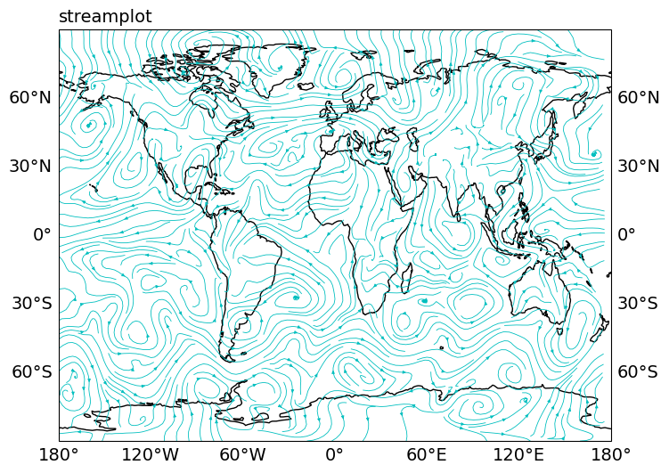 |
| :--: |
|Stream plot of global 10m wind (in m/s), from ERA-I.|

where:

* `gplot.Stream` defines the streamplot plotting method.


## More examples are given in the `tests` subfolder


# Documentation

More detailed documentation can be found at: https://gplot.readthedocs.io/en/latest/


# Dependencies

* Python>=3
* numpy
* matplotlib
* scipy
* [netcdf4](https://unidata.github.io/netcdf4-python)
* [cartopy](https://scitools.org.uk/cartopy/docs/latest/)


# Contributing and getting help

This package is still in **early alpha**.

We welcome contributions from the community. Please create a fork of the
project on GitHub and use a pull request to propose your changes. We strongly
encourage creating an issue before starting to work on major changes, to
discuss these changes first.

