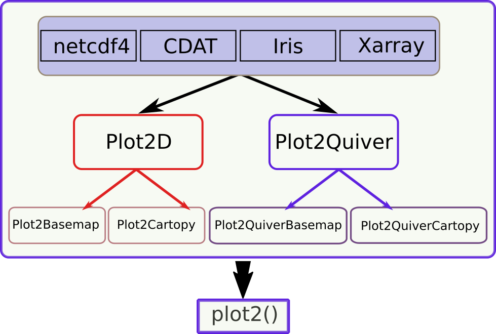

Basic plots
===========

.. contents:: Table of Contents
  :local:

Overall design of gplot
##############################

The overarching structure of *gplot* is pretty simple (see :numref:`Fig.%s <figure1>`):
there are 2 major plotting classes, *Plot2D* and *Plot2Quiver*. The latter
is specifically for 2D quiver plots, and the former
handles mostly commonly used 2D visualization types, including

* contour/isoline
* contourf/isofill
* imshow/boxfill
* pcolormesh
* hatching

These 2 classes accept *ndarray* as inputs, which can be provided by 4 widely
used *netCDF* file I/O modules: *netcdf4*, *CDAT*, *Iris* and *xarray*.
Note that these are optional dependencies, and both *Plot2D* and
*Plot2Quiver* works for plain *ndarray* data as well.

.. note::

   Only *netcdf4* and *CDAT* are currently supported. For the latter, only
   its *cdms2* module is required.

On top of *Plot2D* and *Plot2Quiver*, plotting with geographical map projections
are supported by *basemap* or *Cartopy*, giving rise to 4 derived classes:

* **Plot2Basemap**: 2D plots as *Plot2D* but using *basemap* as the "backend" for geographical map projections.
* **Plot2QuiverBasemap**: 2D quiver plots as *Plot2Quiver* but using *basemap* as the "backend" for geographical map projections.
* **Plot2Cartopy**: 2D plots as *Plot2D* but using *Cartopy* as the "backend" for geographical map projections.
* **Plot2QuiverCartopy**: 2D quiver plots as *Plot2Quiver* but using *Cartopy* as the "backend" for geographical map projections.

.. note::

   *basemap* has been deprecated, however, *Cartopy* is not fully mature in terms
   of features and robustness. More attention is paid on *basemap* plots, and
   the *Cartopy* counterparts are largely work-in-process at the moment.

.. _figure1:

   Overarching structure of gplot.

Basic plotting syntax
#####################

To give an example of using ``Plot2Basemap``:

::

    figure = plt.figure(figsize=(12, 10))
    ax = figure.add_subplot(111)
    iso = gplot.Isofill(var)
    gp = Plot2Basemap(var, iso, lons, lats, ax=ax)
    gp.plot()
    figure.show()

where:

* ``var`` is the ``ndarray`` input data to be plotted.
* ``iso`` is an ``Isofill`` object, which defines an isofill/contourf plot. More
  details on ``Isofill`` are given in :doc:`isofill`.
* ``lons`` and ``lats`` give the longitude and latitude coordinates, respectively. They
  define the geographical domain to generate the map.

This also illustrates the basic "syntax" of *gplot*'s plotting function:
there are 3 major elements that define a plot:

1. ``var``: the input array -- what to plot,
2. ``iso``: the plotting method -- how to plot, and
3. ``ax``: the *matplotlib* *axis* object -- where to plot.

Similarly, for a 2D quiver plot example:

::

    figure = plt.figure(figsize=(12, 10))
    ax = figure.add_subplot(111)
    q = gplot.Quiver(step=8)
    pquiver = Plot2QuiverBasemap(u, v, q, xarray=lons, yarray=lats,
        ax=ax, projection='cyl')
    pquiver.plot()

    figure.show()

Note that in this case, there are 2 input arrays (``u`` and ``v``), the u- and v- velocity
components. And ``q = gplot.Quiver(step=8)`` defines the plotting method.

With these 3 basic elements -- input array, plotting method and axis --
provided, *gplot* will try to handle the remaining trifles for you, including
the axes ticks and labels, colorbar, subplot numbering etc..

Lastly, there is also a ``plot2()`` interface function in ``gplot`` that wraps
everything in a single function call. To reproduce the 1st example above, one
can use:

::

    figure = plt.figure(figsize=(12, 10))
    ax = figure.add_subplot(111)
    iso = gplot.Isofill(var)
    gplot.plot2(var, iso, ax, xarray=lons, yarray=lats)
    figure.show()

And the 2nd example can be achieved using:

::

    figure = plt.figure(figsize=(12, 10))
    ax = figure.add_subplot(111)
    q = gplot.Quiver(step=8)
    gplot.plot2(u, q, ax, xarray=lons, yarray=lats, var_v=v,
        projection='cyl')
    figure.show()

Note that the v- component has been provided using the ``var_v`` keyword argument.

These design choices are taken to achieve the primary goal of *gplot*, which is
to help one create good enough plots as quickly and easily as possible. They
may not be publish-ready, but should visualize the data accurately, and can
be mass-produced with relatively fewer lines of code.
