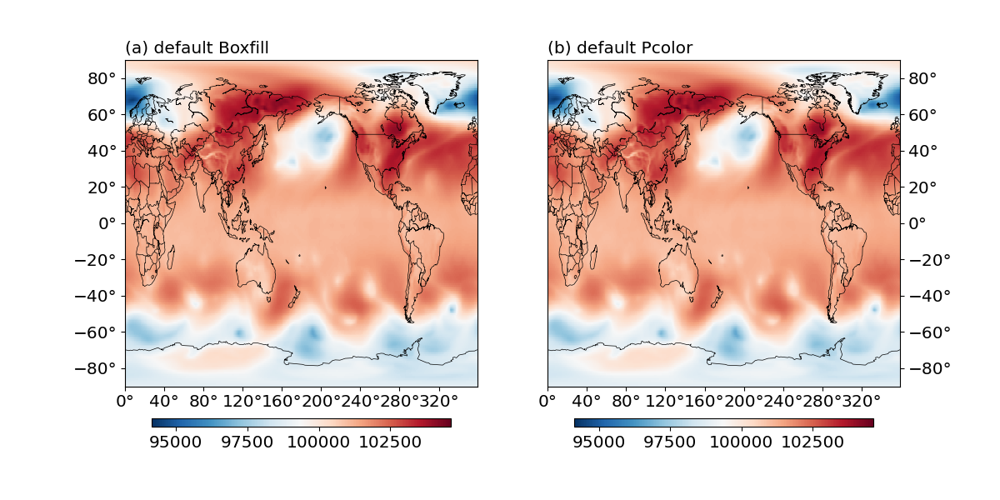

Create boxfill/imshow plots
===========================

.. contents:: Table of Contents
  :local:

The ``Boxfill`` and ``Pcolor`` classes
######################################

A boxfill/imshow plot is created by defining a :py:class:`base_utils.Boxfill`
plotting method, and passing it to the :py:class:`base_utils.Plot2D`
constructor or the :py:func:`base_utils.plot2` function.

All the input arguments to the ``__init__()`` method of
:py:class:`base_utils.Boxfill` are the same as those in
:py:class:`base_utils.Isofill`:

* ``vars``
* ``split``
* ``min_level``
* ``max_level``
* ``ql``
* ``qr``
* ``vcenter``
* ``cmap``

More explanations of these arguments are given in :doc:`isofill`.

The :py:class:`base_utils.Pcolor` class shares the same signature as
:py:class:`base_utils.Boxfill`, and their usages are also identical.
(honestly, is there any difference between the two?)

Basic plot example
###################

A boxfill/imshow/pcolormesh plot is also relatively easier to create. See a
simple example below:

::

    import matplotlib.pyplot as plt
    import gplot
    from gplot.lib import netcdf4_utils

    var = netcdf4_utils.readData('msl')
    lats = netcdf4_utils.readData('latitude')
    lons = netcdf4_utils.readData('longitude')

    figure, axes = plt.subplots( figsize=(12, 6), nrows=1, ncols=2,
            constrained_layout=True)
    box = gplot.Boxfill(var1)
    pc = gplot.Pcolor(var1)
    gplot.plot2( var1, box, axes[0], title='default Boxfill', projection='cyl',
            legend='local')
    gplot.plot2( var1, pc, axes[1], title='default Pcolor', projection='cyl',
            legend='local')
    figure.show()

The result is given in :numref:`Fig.%s <figure5>` below:

.. _figure5:

   Boxfill (a) and Pcolor (b) plot examples.

