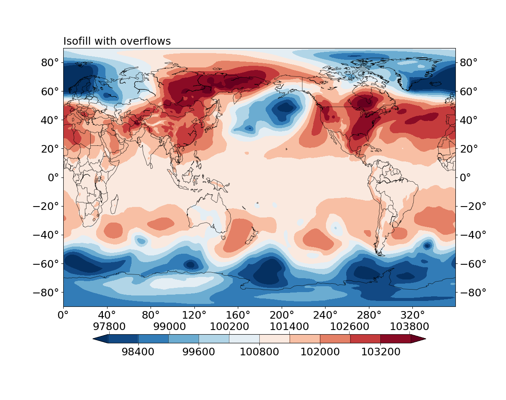

Add colorbars to plots
======================

.. contents:: Table of Contents
  :local:

Positioning of the colorbar
#############################

A colorbar is automatically added for an :doc:`Isofill/contourf <isofill>`, a
:doc:`Boxfill/imshow <boxfill>` and a polychromatic :doc:`Isoline/contour
<isoline>` plot.

The positioning of the colorbar is controlled by the ``legend`` keyword argument
to the :py:func:`base_utils.Plot2D.__init__`, or the
:py:func:`base_utils.plot2` function. It can have 1 of the 3 possible values:

* ``legend = 'global'``: the default. If there are more than 1 subplots in the figure, all subplots
  share the same colorbar, which is created by the 1st subplot. If only 1 subplot in
  the figure, same as ``legend = 'local'``.
* ``legend = 'local'``: subplots in the figure have their own colorbars.
* ``legend = None``: don't plot the colorbar.

Additionally, the ``legend_ori`` argument specifies the orientation of the colorbar:

* ``legend_ori = 'horizontal'``: horizontal colorbar.
* ``legend_ori = 'vertical'``: vertical colorbar.

.. note::
   Only the right (for vertical colorbar) and bottom (for horizontal colorbar)
   side of the subplot/figure placement are supported. Top and left side
   placement are not supported in *gplot*. However, one can create the colorbar
   on their own, by setting ``legend = None``, and using the returned *mappable object*.

Overflows on a colorbar
#############################

**Overflow** is represented by a triangle on either end of the colorbar (see
:numref:`Fig.%s <figure7>` below for an example).  It signals that all values
below the minimum overflow level are represented by the color of the left
triangle, and all values above the maximum overflow level by the right
triangle. Namely, one chooses to selectively plot only a sub-range of the
data values.

Overflows are **ONLY** added if the range of data exceeds the range plotted.
And they can be introduced by setting the ``min_level`` or ``ql`` arguments (for
the left overflow), and the ``max_level`` or ``qr`` arguments (for the right
overflow).

.. seealso::
   :py:class:`base_utils.Isofill`, :py:class:`base_utils.Isoline`, :py:class:`base_utils.Boxfill`

.. _figure7:

   Isofill plot with overflows on both sides.

Alternating top and bottom ticks of a horizontal colorbar
#########################################################

In an :doc:`Isofill/contourf <isofill>` plot, if the number of levels is too
big, the tick labels of a horizontal colorbar may start to overlap with each
other. In some cases this can be solved by putting half of the tick labels on
the top side and half on the bottom side (see :numref:`Fig.%s <figure7>` above
or :ref:`this figure <figure2>` for examples).

This functionality is automatically enabled, but only for
:doc:`Isofill/contourf <isofill>` plots with horizontal colorbars.

.. note::
   If the number of contour levels keeps on growing, the tick labels
   may start to overlap again. In such cases, it is worth trying either reducing the
   level numbers, or using a smaller font size.

