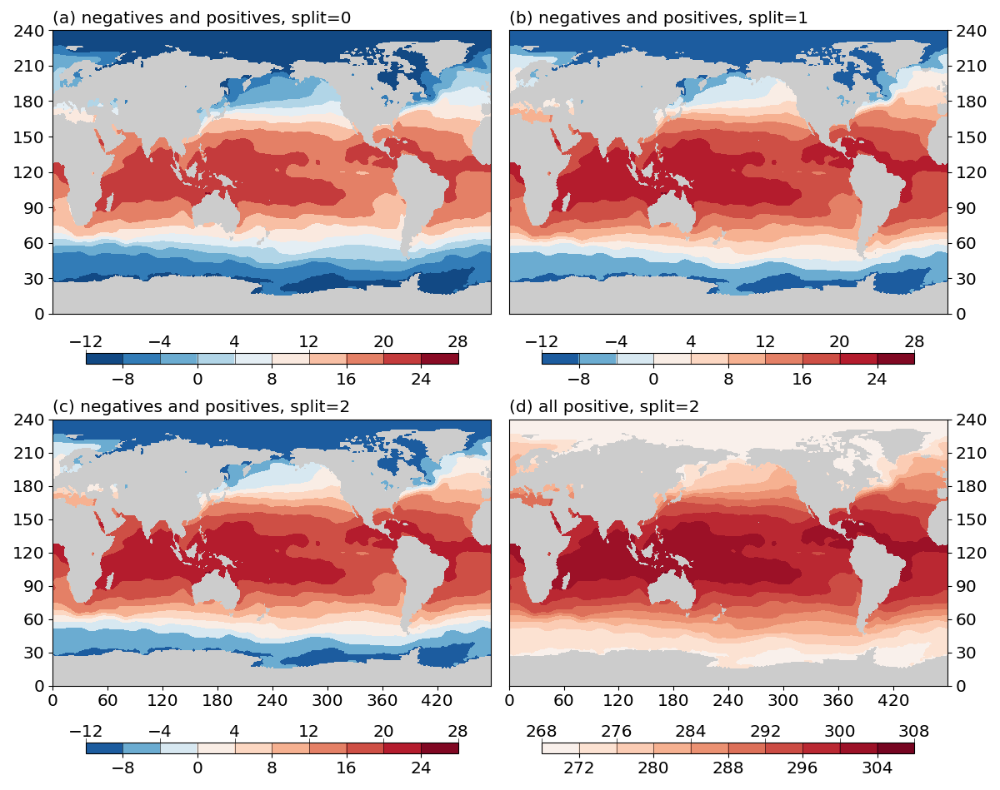
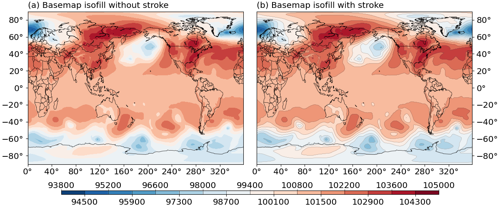

Create isofill/contourf plots
=============================

.. contents:: Table of Contents
  :local:

The ``Isofill`` class
##############################

To create a isofill/contourf plot, one creates a :py:class:`base_utils.Isofill`
object as the plotting method, and passes it to the :py:class:`base_utils.Plot2D`
constructor or the :py:func:`base_utils.plot2` function.

Define the contour levels
##############################

One key element of a good isofill/contourf plot is a set of appropriately
chosen contour levels. There are basically 2 ways to define the contour levels
in :py:class:`base_utils.Isofill`:

1. Automatically derive from input data, and a given number of levels
^^^^^^^^^^^^^^^^^^^^^^^^^^^^^^^^^^^^^^^^^^^^^^^^^^^^^^^^^^^^^^^^^^^^^^

Your data may come with various orders of magnitudes, and sometimes it can be
a bit tricky (and annoying) to manually craft the contour levels for each and
every plot you create, particularly when you just want to have a quick read of
the data. The 1st approach comes as a handy choice for such cases.

To automatically derive the contour levels, these input arguments to the
constructor of :py:class:`base_utils.Isofill` are relevant:

* ``vars``: input data array(s).

  The 1st and only mandatory input argument is ``vars``, which is the input
  ``ndarray`` to plot, or a list of ``ndarray``. This is used to determine the
  value range of the input data. Missing values (masked or ``nan``) are not
  taken into account.

  The list input form is useful when one wants to use the same set of contour
  levels to plot multiple pieces of data.

* ``num``: the **desired** number of contour levels.

  Note that in order to derive nice-looking numbers in the contour levels, the
  resultant number may be sightly different.

  What is meant by "nice-looking" is that the contour level values won't be some
  floating point numbers with 5+ decimal places, like what one would get using

  ::

      >>> np.linspace(0, 30, 12)
      array([ 0.        ,  2.72727273,  5.45454545,  8.18181818, 10.90909091,
             13.63636364, 16.36363636, 19.09090909, 21.81818182, 24.54545455,
             27.27272727, 30.        ])

  Instead, :py:class:`base_utils.Isofill` would suggest something like this:

  ::

      [0.0, 2.5, 5.0, 7.5, 10.0, 12.5, 15.0, 17.5, 20.0, 22.5, 25.0, 27.5, 30.0]

* ``zero``: whether ``0`` is allowed to be one contour level.

  ``zero = 0`` exerts no inference on the inclusion of ``0``.

  ``zero = -1`` prevents the number ``0`` from being included in the contour levels,
  instead, there would be a 0-crossing contour interval, e.g. ``-2, 2``,
  that represent the 0-level with a range.

  This is very helpful in plots with a divergent colormap, e.g.
  ``plt.cm.RdBu``.  Your plot will have a white contour interval, rather than
  just various shades of blues and reds.  The white area represents a kind of
  buffer zone in which the difference is not far from 0, and the plot will
  almost always end up being cleaner and more informative.

* ``min_level``, ``max_level``, ``ql``, ``qr``: determines the lower and
  upper bounds of the data range to plot.

  ``min_level`` and ``max_level`` are used to specify the *absolute* bounds. If
  ``None`` (the default), these are taken from the minimum and maximum values
  from ``vars``.

  ``ql`` and ``qr`` are used to specify by relative bounds: ``ql`` for the left
  quantile and ``qr`` for the right quantile. E.g. ``ql = 0.01`` takes the ``0.01``
  left quantile as the lower bound, and ``qr = 0.05`` takes the 0.95 quantile
  as the upper bound. These are useful for preventing some outliers from inflating
  the colorbar.

  If both ``ql`` and ``min_level`` are given, whichever gives a greater absolute
  value is chosen as the lower bound. Similarly for ``qr`` and ``max_level``.

  If the lower/upper bound doesn't cover the entire data range, an **extension**
  is on the relevant side is activate:

  ::

        self.ext_1 = True if self.data_min < vmin else False
        self.ext_2 = True if self.data_max > vmax else False

  These will be visually represented as an **overflow** on the colorbar.

2. Manually specify the contour levels.
^^^^^^^^^^^^^^^^^^^^^^^^^^^^^^^^^^^^^^^^^^^^^^^^^^^^^^^^^^^^^^^^^^^^^^

Manual contour levels are simply specified by the `levels` optional argument:

::

  iso = Isofill(var, 10, levels=np.arange(-10, 12, 2))

This will override the effects from all the arguments listed in the above section,
except that overflows will still be added, if your specified levels do not cover
the entire data range.

Choose the colormap
####################

The colormap is specified using the ``cmap`` argument, which is default to
a blue-white-red divergent colormap ``plt.cm.RdBu_r``.

To use a different colormap, can provide with a different one from the *matplotlib*
colormap collection, e.g. ``cmap = plt.cm.rainbow``. It is possible to provide
only the name of the colormap as a string: ``cmap = 'rainbow'``.

Split the colormap colors
##############################

**Divergent colormaps** are commonly used in academic works. E.g. the
``plt.cm.RdBu_r`` colormap is one divergent colormap, with a transition from
dark blue (the minimum) to white in the middle, and finally to dark red (the
maximum) on the right.

The middle color (white in this case) usually corresponds to critical
transition in the data (e.g. going from negative to positive), therefore it is
crucial to make sure they are aligned up. See an example:

::

    import matplotlib.pyplot as plt
    import gplot
    from gplot.lib import netcdf4_utils

    # read in SST data
    var2 = netcdf4_utils.readData('sst')
    lats = netcdf4_utils.readData('latitude')
    lons = netcdf4_utils.readData('longitude')

    var2ano=var2-280.  # create some negative values

    figure, axes = plt.subplots(figsize=(12, 10), nrows=2, ncols=2,
            constrained_layout=True)

    iso1=gplot.Isofill(var2ano, num=11, zero=1, split=0)
    gplot.plot2(var2ano, iso1, axes.flat[0], legend='local',
            title='negatives and positives, split=0')

    iso2=gplot.Isofill(var2ano, num=11, zero=1, split=1)
    gplot.plot2(var2ano, iso2, axes.flat[1], legend='local',
            title='negatives and positives, split=1')

    iso3=gplot.Isofill(var2ano, num=11, zero=1, split=2)
    gplot.plot2(var2ano, iso3, axes.flat[2], legend='local',
            title='negatives and positives, split=2')

    iso4=gplot.Isofill(var2, num=11, zero=1, split=2)
    gplot.plot2(var2, iso4, axes.flat[3], legend='local',
            title='all positive, split=2')

    figure.show()
    figure.tight_layout()

The output is given in :numref:`Fig.%s <figure2>` below:

.. _figure2:

   Effects of the ``split`` argument.
   (a) do not split the colormap for data with negative and positive values (``split=0``).
   (b) split the colormap if data have both negative and positive values (``split=1``).
   (c) force split the colormap when data have both negative and positive values (``split=2``).
   (c) force split the colormap when data have only positive values (``split=2``).

To summarize:

* ``split=0``: do not split the colormap.
* ``split=1``: split the colormap if data have both positive and negative values. Do not split if data have only negative or only positive values.
* ``split=2``: force split. If the data have both positive and negative values, the effect
  is the same as ``split=1``. If data have only positive (negative) values, will only
  use the right (left) half of the colormap.

.. note::

    Positive v.s. negative is one way of splitting the data range into 2 halves,
    at the dividing value of ``0``.
    It is possible to use arbitray dividing value, by using the ``vcenter`` argument.
    E.g.  ``iso = gplot.Isofill(var, num=10, split=2, vcenter=10)``

Overlay with stroke
##############################

It is possible to stroke the isofill/contourf levels with a layer of thin
contour lines. E.g.

::

    import matplotlib.pyplot as plt
    import gplot
    from gplot.lib import netcdf4_utils

    # read in SLP data
    var1 = netcdf4_utils.readData('msl')
    lats = netcdf4_utils.readData('latitude')
    lons = netcdf4_utils.readData('longitude')

    figure, (ax1, ax2) = plt.subplots(figsize=(12, 5), nrows=1, ncols=2,
            constrained_layout=True)

    iso1 = gplot.Isofill(var1)
    gplot.plot2(var1, iso1, ax1, title='Basemap isofill without stroke',
                projection='cyl')

    iso2 = gplot.Isofill(var1, stroke=True)
    gplot.plot2(var1, iso2, ax2, title='Basemap isofill with stroke',
                projection='cyl')
    figure.show()

The result is given in :numref:`Fig.%s <figure3>` below:

.. _figure3:

   Effects of the ``stroke`` argument.
   (a) isofill plot without stroke.
   (b) isofill plot with stroke.

``stroke`` is set to ``False`` by default. To further control the line width of
the stroke, use the ``stroke_lw`` argument, which is default to ``0.2``.
The line color is default to a grey color (``stroke_color = 0.3``), and line style
default to solid (``stroke_linestyle = '-'``).

