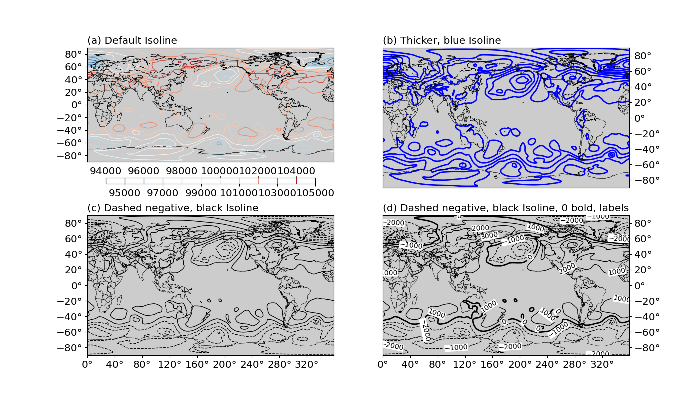

Create isoline/contour plots
============================

.. contents:: Table of Contents
  :local:

The ``Isoline`` class
##############################

To create an isoline/contour plot, one creates a :py:class:`base_utils.Isoline`
object as the plotting method, and passes it to the :py:class:`base_utils.Plot2D`
constructor or the :py:func:`base_utils.plot2` function.

In many aspects, the :py:class:`base_utils.Isoline` class is similar as
:py:class:`base_utils.Isofill` (it is in fact derived from the latter).
They share these arguments in their ``__init__()`` methods:

* ``vars``
* ``num``
* ``zero``
* ``split``
* ``levels``
* ``min_level``
* ``max_level``
* ``ql``
* ``qr``
* ``vcenter``
* ``cmap``

More explanations of these arguments are given in :doc:`isofill`.

There are a few arguments unique to ``Isoline``, and are introduced below.

Line width and color controls
##############################

Line width is controlled by the ``line_width`` input argument, which is default
to ``1.0``.
See :numref:`Fig.%sb <figure4>` for an example of changing the line width to a
larger value.

Line color, by default, is determined by the colormap (``cmap``).
Alternatively, one can use only the black color by specifying ``black = True``.
Or, use a different color for all contour lines ``color = 'blue'``.
For single colored isoline plots, the colorbar will not be plotted.
See :numref:`Fig.%sb,c,d <figure4>` for examples of monochromatic isoline plots.

.. _figure4:

   Isoline plot examples. Complete script can be found in :py:func:`tests.basemap_tests.test_basemap_isolines`
   (a) default isoline plot: colored contours, ``linewidth=1``.
   (b) isoline plot with ``linewidth=2.0, color='b'``.
   (c) isoline plot with ``black=True, dash_negative=True``.
   (d) isoline plot with ``black=True, dash_negative=True, bold_lines=[0,], label=True, label_box=True``.

Use dashed line for negatives
##############################

It is also common to use dashed lines for negative contours and solid lines
for positive ones, with optionally a 0-level contour as bold. These can
be achieved using:

::

    isoline = gplot.Isoline(var, 10, zero=1, black=True, dash_negative=True,
                            bold_lines=[0,])

See :numref:`Fig.%sc,d <figure4>` for examples.

.. note::

   It is possible to set multiple levels as bold, by specifying them in a list
   to ``bold_lines``.

Label the contour lines
##############################

For plots with monochromatic contour lines, one needs to provide a different mechanism
for the reading of contour levels, such as labelling out the contours. This can
be achieved by passing in the ``label = True`` argument.

The format of the labels can be controlled by ``label_fmt``. If left as ``label_fmt = None``,
it will use a default ``Formatter``.
An optional bounding box can be added by ``label_box = True``, and one can
change the box background color by altering ``label_box_color``.
See :numref:`Fig.%sd <figure4>` for an example.

The mappable object
##############################

*gplot* calls *matplotlib*'s (or *basemap*'s, if it is using *Plot2Basemap*)
``contour()`` function under the hood. The function returns a *mappable object*,
e.g. ``cs = plt.contour(data)``. This mappable object is stored as
an attribute of the :py:class:`base_utils.Plot2D` (or
:py:class:`basemap_utils.Plot2Basemap`) object:

::

    >>> plotobj = Plot2Basemap(var, iso, lons, lats, ax=ax)
    >>> plotobj.plot()
    >>> plotobj.cs
    <matplotlib.contour.QuadContourSet object at 0x7f0e3e6b4550>

The same ``plotobj`` is returned by the :py:func:`base_utils.plot2` function,
therefore, the mappable object can be retrieved using:

::

    >>> pobj = gplot.plot2(var, iso, ax, xarray=lons, yarray=lats)
    >>> pobj.cs
    <matplotlib.contour.QuadContourSet object at 0x7f0e3e6b4550>

