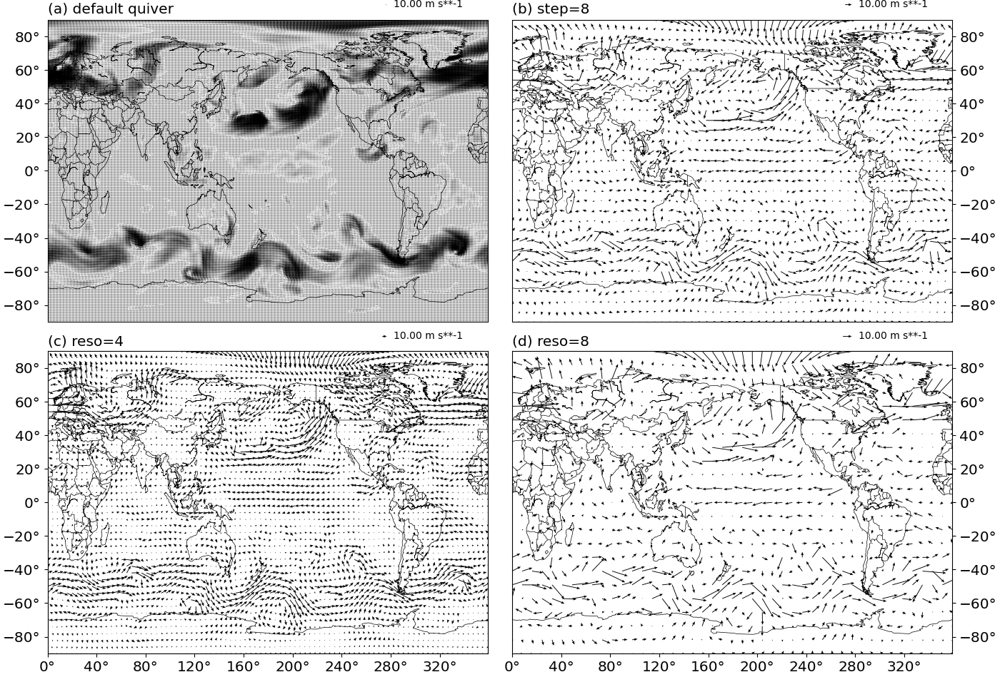
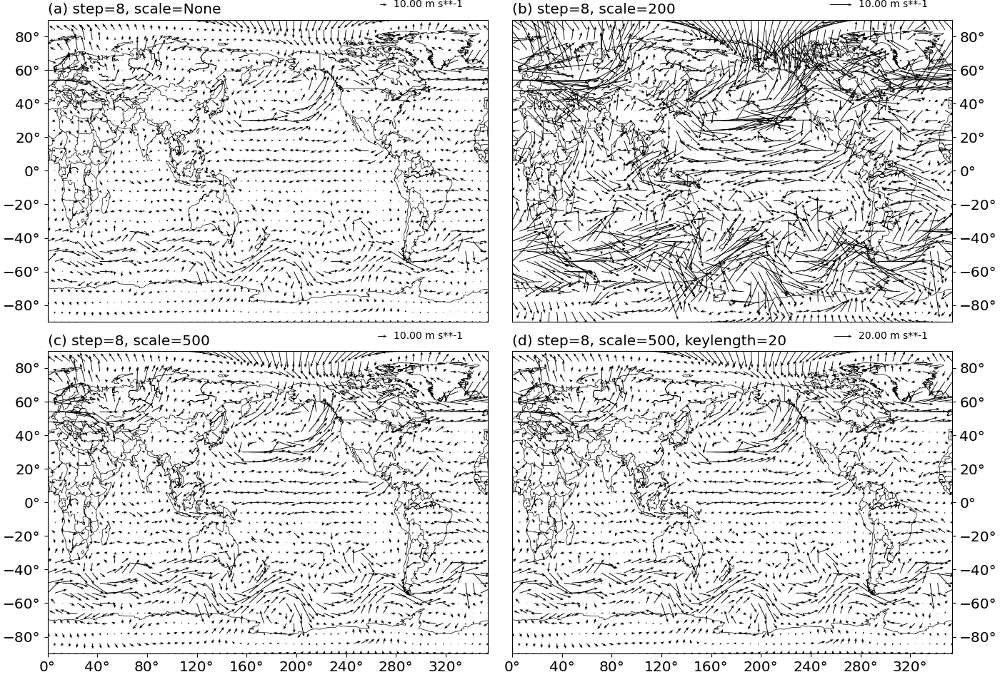
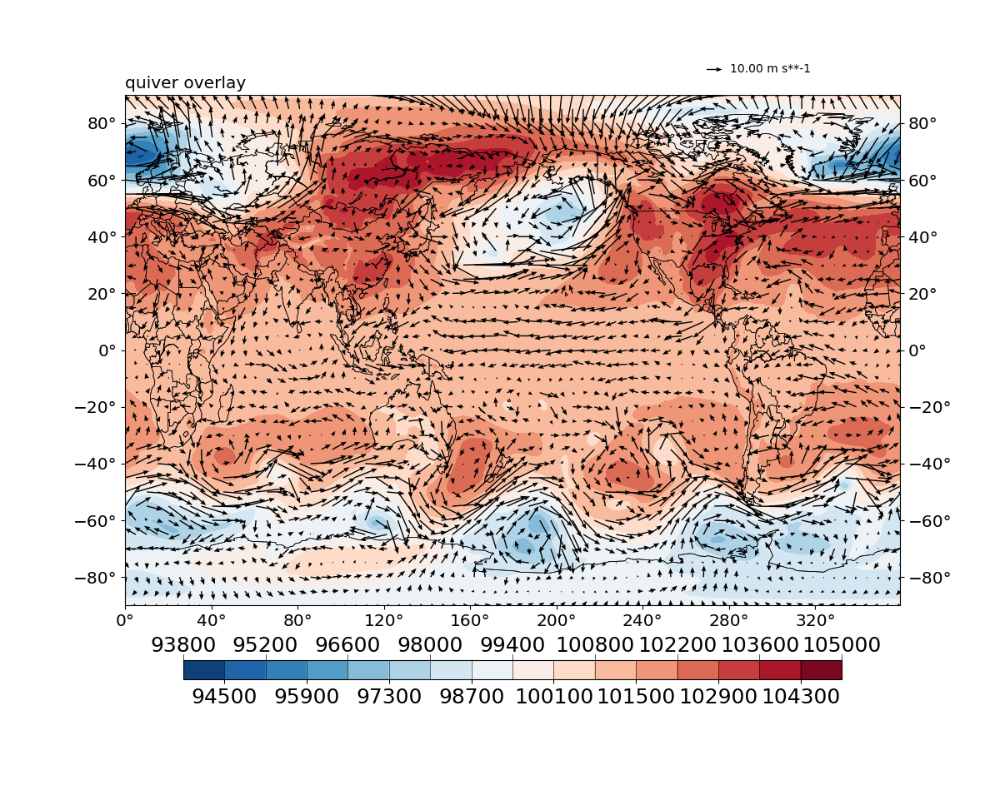

Create quiver plots
===================

.. contents:: Table of Contents
  :local:

The ``Quiver`` class
##############################

To create a 2D quiver plot, one creates a :py:class:`base_utils.Quiver`
object as the plotting method, and passes it to the :py:class:`base_utils.Plot2Quiver`
constructor or the :py:func:`base_utils.plot2` function.

The ``__init__()`` of :py:class:`base_utils.Quiver` takes these input arguments:

* ``step``
* ``reso``
* ``scale``
* ``keylength``
* ``linewidth``
* ``color``
* ``alpha``

``linewidth``, ``color`` and ``alpha`` should be self-explanatory. Others are explained
in further details below.

Control the quiver density
###########################

When the input data have too fine a resolution, the quiver plot may end up being
too dense and not quite readable (see :numref:`Fig.%sa <figure8>` below for an
example). This can be solved by either

1. sub-sampling the data with a step: ``u = u[::step, ::step]; v = v[::step, ::step]``, or
2. regridding the data to a lower resolution ``reso``.

Method 1 is controlled by the ``step`` input argument (see :numref:`Fig.%sb
<figure8>` below for an example), and the latter method the ``reso`` argument
(see :numref:`Fig.%sc,d <figure8>`). If both are given, the
latter one takes precedence.

.. note::
   regridding requires *scipy* as an optional dependency.

.. _figure8:

   Density control of a quiver plot.
   (a) default quiver density ``q = Quiver()``.
   (b) reduced density by sub-sampling: ``q = Quiver(step=8)``.
   (c) reduced density by regridding: ``q = Quiver(reso=4)``.
   (d) reduced density by regridding: ``q = Quiver(reso=8)``.

Control the quiver lengths
###########################

The lengths of the quiver arrows are controlled by the ``scale`` argument.  A
larger scale value creates shorter arrows.  When left as the default ``None``,
it will try to derive a suitable scale level for the given inputs.

The length of the reference quiver arrow is controlled by the ``keylength``
argument. Given a set ``scale``, a larger ``keylength`` makes the **reference**
quiver arrow longer.  Similar as ``scale``, ``keylength`` is default to
``None``, and the plotting function will try to derive a suitable value
automatically for you.

:numref:`Fig.%s <figure9>` below shows some examples of controlling the lengths.

.. _figure9:

   Length control of a quiver plot.
   (a) automatic scale ``q = Quiver(step=8, scale=None)``.
   (b) specify scale=200: ``q = Quiver(step=8, scale=200)``.
   (c) specify scale=500: ``q = Quiver(step=8, scale=500)``.
   (d) specify scale=500, keylength=20: ``q = Quiver(step=8, scale=500, keylength=20)``.

Quiver overlay
##################

It is common to see quiver plots superimposed on top of an isofill/contourf plot.
To achieve this, simply re-use the same ``axis`` object in the isofill/contourf
plot, and the subsequent quiver plot. E.g.

::

    figure = plt.figure(figsize=(12, 10), dpi=100)
    ax = figure.add_subplot(111)
    iso = gplot.Isofill(var1)
    q = gplot.Quiver(reso=5, scale=500)

    gplot.plot2(var1, iso, ax, projection='cyl')
    gplot.plot2(u, q, var_v=v, xarray=lons, yarray=lats,
                ax=ax, title='quiver overlay', projection='cyl')
    figure.show()

The result is given in :numref:`Fig.%s <figure10>` below.

.. _figure10:

   Quiver plot on top of isofill.

Curved quiver plots
##############################

Sometimes one needs to visualize a vector field in a region where the vector
magnitudes are rather small, and a larger domain is needed to be shown at the
same time to give enough context. In such cases, when the ``scale`` is adjusted
to a comfortable value for the target region to be readable, other regions may
have quiver arrows that are too large and the plot looks messy.

One possible solution is to use curved quivers rather than straight ones.
``matplotlib`` does not support this out-of-the-box, some hacks are used to
achieve this. Due credits to the author of `this repo
<https://github.com/kieranmrhunt/curved-quivers>`_, and `this stackoverflow
answer <https://stackoverflow.com/a/65607512/2005415>`_.

A curved quiver plot is done by passing in ``curve=True``, e.g.:

::

    figure = plt.figure(figsize=(12, 10), dpi=100)
    ax = figure.add_subplot(111)
    q = gplot.Quiver(step=8)
    pquiver = Plot2QuiverBasemap(
        u, v, q, xarray=lons, yarray=lats, ax=ax, title='curved quiver',
        projection='cyl', curve=True)
    pquiver.plot()

    figure.show()

The result is given in :numref:`Fig.%s <figure11>` below.

.. _figure11:

.. figure:: curved_quiver.png
   :width: 600px
   :align: center
   :figclass: align-center

   Curved quiver plot.

.. note::
   Curved quiver plot takes notably longer to generate, and is considered
   experimental at the moment.

The mappable object
##############################

The *mappable object* of a quiver plot is stored as an attribute of the
:py:class:`base_utils.Plot2Quiver` (or
:py:class:`basemap_utils.Plot2QuiverBasemap`) object:

::

    >>> q = gplot.Quiver()
    >>> pobj = Plot2QuiverBasemap(u, v, q, xarray=lons, yarray=lats, ax=ax, projection='cyl')
    >>> pobj.plot()
    >>> pobj.quiver
    <matplotlib.quiver.Quiver object at 0x7f2e03aed750>

